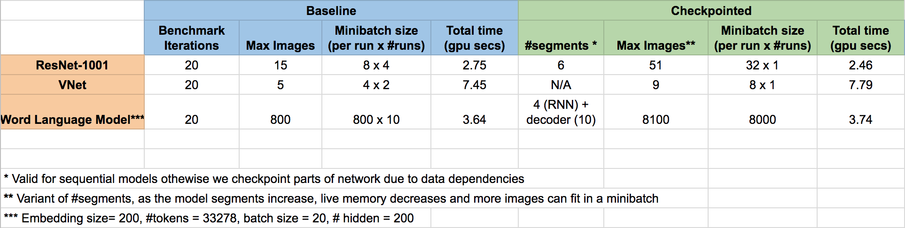

# pytorch_memonger

This repository contains implementation of various PyTorch models using the
**gradient checkpointing**[1] which allows trading compute for memory and hence allows
training bigger/wider models and use large minibatch sizes.

The application of checkpointing is showcased on various models:

- ResNet
- DenseNet
- LSTM model from pytorch examples [here](https://github.com/pytorch/examples/blob/master/word_language_model/model.py)
- VNet model which is used in medical imaging applications, available [here](https://github.com/mattmacy/vnet.pytorch)

Results of checkpointing on these models are showcased below:

<p align="center"></p>

In order to use the models, you need to install PyTorch master following instructions from [here](https://github.com/pytorch/pytorch/#from-source)

To run checkpointed models and their baseline tests, follow the commands below:
```
# for checkpointed
python test_memory_optimized.py

# for baseline
python test_memory_optimized.py
```

## Tutorial

We provide a [tutorial]() to describe how to use checkpointing for various kinds of
models.

There are few special kinds of layers like Batch normalization, dropout that should
be handled carefully. The details for handling those are also available in the
tutorial

## References

[1]. Siskind, Jeffrey Mark, and Barak A. Pearlmutter. "Divide-and-Conquer Checkpointing for Arbitrary Programs with No User Annotation." arXiv preprint arXiv:1708.06799 (2017).
